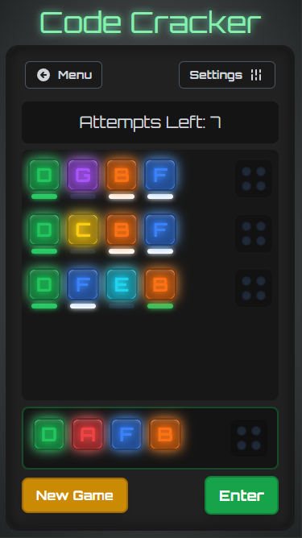

# Mastermind Code Cracker

A modern, skeuomorphic take on the classic Mastermind board game. Challenge yourself to crack the secret code within a limited number of attempts in a high-tech, retro-futuristic interface.

---

## ✨ Core Features

*   **Classic Code-Cracking Gameplay:** Guess the secret combination of colors, letters, or numbers.
*   **Two Game Modes:**
    *   **Campaign Mode:** Progress through 30 hand-crafted levels of increasing difficulty, introducing new challenges like shorter time limits and complex feedback systems.
    *   **Free Play Mode:** Fully customize your game. You control the rules!
*   **Deep Customization:**
    *   Adjust **code length** (4-6 pegs).
    *   Vary the **number of colors** (up to 10 unique options).
    *   Set the **maximum number of attempts**.
    *   Choose your **difficulty** ('Simple' vs. 'Hard' feedback).
    *   Add a **time limit** for an extra layer of challenge.
*   **Multiple Code Representations:** Play with classic **colors**, or switch to **letters** (A, B, C...) or **numbers** (1, 2, 3...) for better accessibility and player preference.
*   **Skeuomorphic & High-Tech UI:** A tactile interface with glowing elements, satisfying animations, and dynamically generated sound effects that immerse you in the code-cracking experience.
*   **Responsive & Mobile-Ready:** Looks and plays great on both desktop and mobile devices, with PWA support for a native-app-like "Add to Home Screen" experience.

---

## 🎮 How to Play

### The Objective

Your goal is to guess the secret code generated by the system. The code is a sequence of unique colors/letters/numbers of a specific length.

### Making a Guess

1.  In the "Operating Area" at the bottom, click on the empty pegs to cycle through the available options.
2.  For faster selection on desktop, you can also use your mouse wheel while hovering over a peg.
3.  Once your combination is set, press the **Enter** button to submit your guess.

### Understanding the Feedback

After each guess, the system will provide feedback to help you deduce the secret code. The type of feedback depends on the selected difficulty mode.

#### 💚 Simple Mode

In Simple mode, each peg in your guess gets direct, positional feedback via a small indicator light beneath it.

*   **Green Light:** Correct item in the correct position.
*   **White Light:** Correct item, but in the wrong position.
*   **Dark Light:** This item is not in the secret code at all.

#### 🤍 Hard Mode

Hard mode provides a more challenging, aggregate feedback for the entire guess. The small pegs on the right side will light up to tell you:

*   **Green Pegs:** The *total number* of items that are the correct color AND in the correct position.
*   **White Pegs:** The *total number* of items that are the correct color but in the WRONG position.

The feedback pegs in Hard mode are not ordered, so you don't know which of your guessed items they correspond to!

### Winning & Losing

*   **You Win:** Guess the secret code correctly before running out of attempts or time.
*   **You Lose:** You exhaust all your attempts or the timer reaches zero. The correct code will be revealed.

---

## 🛠️ Technical Stack

*   **Framework:** React
*   **Language:** TypeScript
*   **Styling:** Tailwind CSS for utility-first styling and custom CSS for keyframe animations.
*   **Audio:** Web Audio API for dynamically generated sound effects, eliminating the need for external audio files.
*   **Build System:** Modern ES Modules with an import map.
